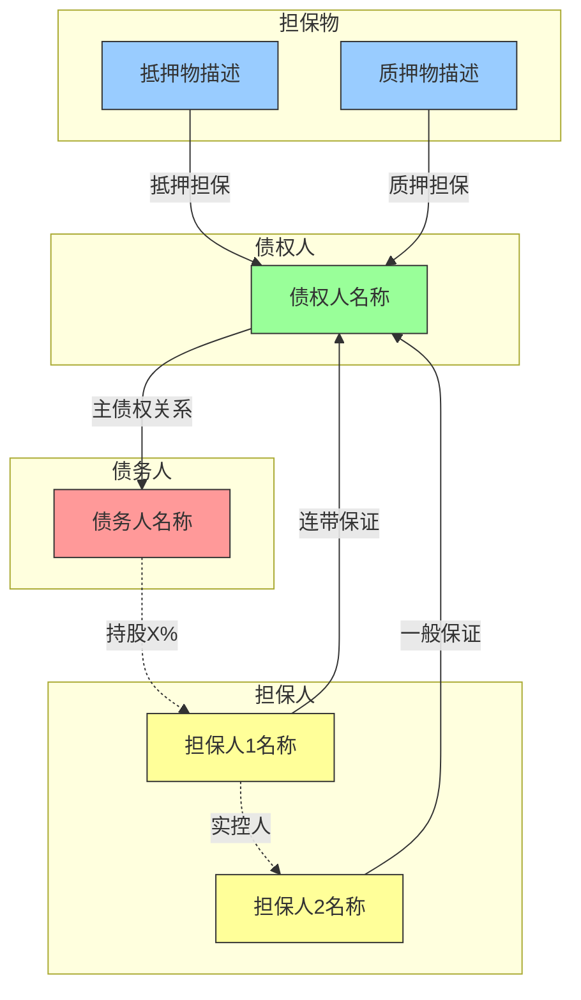
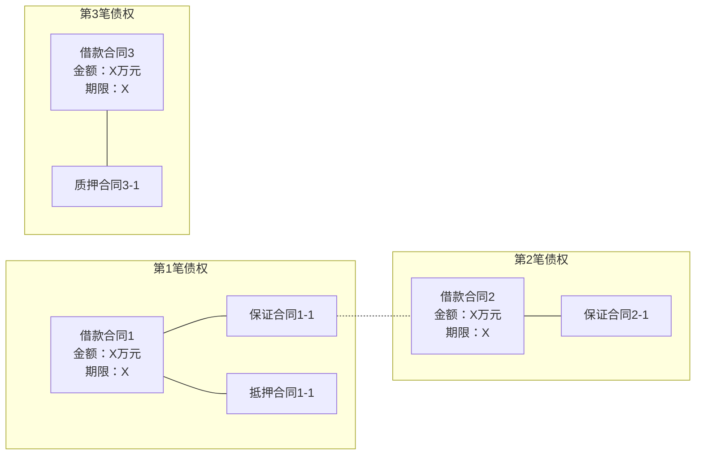
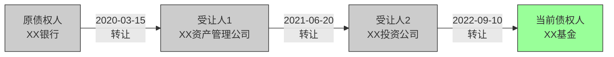
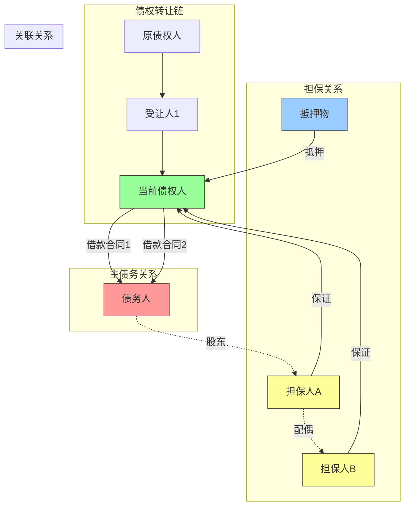
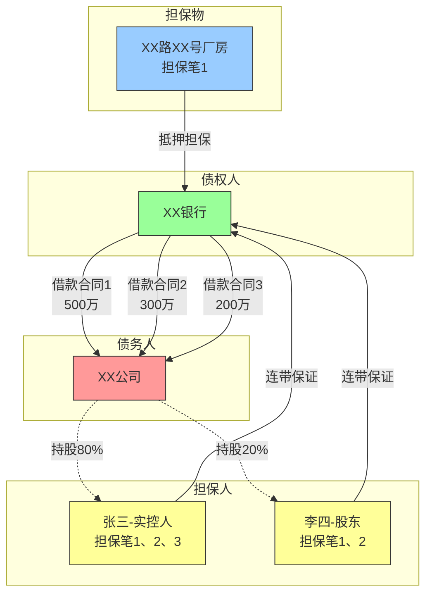
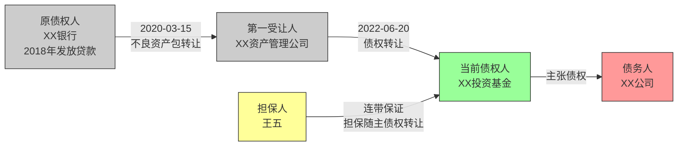
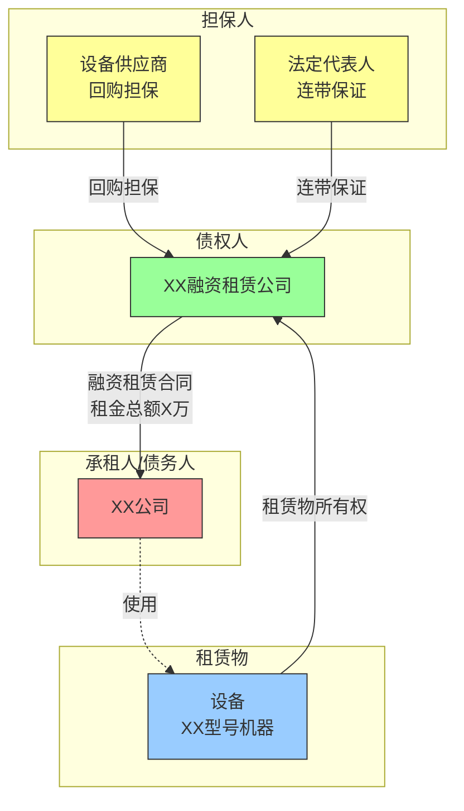

# Mermaid法律关系图生成指南

## 概述

本指南定义法律关系图的生成规则、标准样式和输出格式。法律关系图用于可视化展示债权人、债务人、担保人之间的复杂关系。

**输出格式**：Mermaid代码（Markdown原生支持）
**存放位置**：独立文件 `{债权人名称}_法律关系图.md`，存放于 `工作底稿/` 目录

---

## 一、生成条件

### 必须生成法律关系图的情况

| 条件 | 说明 |
|------|------|
| ≥1个担保人 | 存在保证担保关系 |
| ≥1个担保物 | 存在抵押或质押担保 |
| ≥2笔债权 | 同一债权人多笔贷款 |
| 存在债权转让 | 债权转让链条 |

**判断逻辑**：满足任一条件即生成。

### 无需生成的情况

- 单笔债权 + 无担保 + 无转让
- 材料过于简单，关系一目了然

---

## 二、图表类型

### 2.1 主体关系图

**用途**：展示债权人、债务人、担保人之间的关系

**触发条件**：存在担保人或担保物

**Mermaid模板**：



### 2.2 合同关系图

**用途**：展示多笔贷款与担保合同的对应关系

**触发条件**：≥2笔贷款

**Mermaid模板**：



### 2.3 债权转让链图

**用途**：展示债权从原始债权人到当前债权人的转让历程

**触发条件**：存在债权转让

**Mermaid模板**：



### 2.4 综合关系图（复杂场景）

**用途**：当关系特别复杂时，将多种关系整合在一张图中

**触发条件**：多笔债权 + 复杂担保 + 债权转让同时存在

**Mermaid模板**：



---

## 三、标准样式定义

### 3.1 颜色规范

| 主体类型 | 填充色 | 说明 |
|----------|--------|------|
| 债权人 | `fill:#9f9` | 绿色，表示权利方 |
| 债务人 | `fill:#f99` | 红色，表示义务方 |
| 担保人 | `fill:#ff9` | 黄色，表示从属义务方 |
| 担保物 | `fill:#9cf` | 蓝色，表示物的担保 |
| 历史主体 | `fill:#ccc` | 灰色，表示已退出关系 |

### 3.2 连线规范

| 连线类型 | 语法 | 用途 |
|----------|------|------|
| 实线箭头 | `-->` | 直接法律关系（债权、担保） |
| 实线无箭头 | `---` | 合同从属关系 |
| 虚线箭头 | `-.->` | 关联关系（股权、亲属） |
| 虚线无箭头 | `-.-` | 跨笔担保关系 |

### 3.3 标签规范

**节点标签**：
- 债权人/债务人：使用全称（如过长可适当简化）
- 担保人：全称 + 身份说明（如"担保人A-股东"）
- 担保物：类型 + 简要描述（如"抵押物-XX路XX号房产"）
- 金额：使用"X万元"格式

**连线标签**：
- 保证：`连带保证` 或 `一般保证`
- 抵押/质押：`抵押担保` 或 `质押担保`
- 转让：日期 + "转让"

---

## 四、生成流程

### 4.1 标准流程

```
Step 1: 分析债权结构概览
    ↓
Step 2: 确定需要生成的图表类型
    ↓
Step 3: 提取关键信息（主体、关系、金额、日期）
    ↓
Step 4: 选择合适的模板
    ↓
Step 5: 填充实际内容
    ↓
Step 6: 验证Mermaid语法
    ↓
Step 7: 生成独立文件
```

### 4.2 信息提取要点

**从债权结构概览提取**：
- 债权人名称和类型
- 债务人名称
- 债权笔数和各笔金额
- 担保人列表和担保方式
- 担保物列表和担保类型
- 债权转让链条

**关联关系识别**（如可得知）：
- 股权关系（股东、实控人）
- 亲属关系（配偶、父子）
- 关联公司关系

---

## 五、输出文件格式

### 5.1 文件命名

`{债权人名称}_法律关系图.md`

### 5.2 文件结构

```markdown
# [债权人名称] 法律关系图

**生成日期**：[YYYY-MM-DD]
**数据来源**：债权结构概览、事实核查报告

---

## 一、主体关系图

[图表说明]

```mermaid
[Mermaid代码]
```

---

## 二、合同关系图

[图表说明，如不适用标注"本案不适用"]

```mermaid
[Mermaid代码]
```

---

## 三、债权转让链图

[图表说明，如不适用标注"本案不适用"]

```mermaid
[Mermaid代码]
```

---

## 四、图例说明

| 颜色 | 含义 |
|------|------|
| 绿色 | 债权人（权利方） |
| 红色 | 债务人（主债务人） |
| 黄色 | 担保人（保证人） |
| 蓝色 | 担保物（抵押/质押） |
| 灰色 | 历史主体（已退出） |

| 线型 | 含义 |
|------|------|
| 实线箭头 | 直接法律关系 |
| 虚线箭头 | 关联关系（股权、亲属等） |

---

## 五、关键关系说明

[用文字补充说明图表中难以表达的复杂关系]

1. **担保覆盖范围**：[说明]
2. **共同担保情况**：[说明]
3. **关联关系说明**：[说明]
```

---

## 六、常见场景示例

### 6.1 银行多笔贷款 + 混合担保

**场景**：某银行3笔贷款，2个保证人，1个抵押物，部分担保跨笔



### 6.2 AMC受让债权 + 多轮转让

**场景**：原银行贷款经2次转让至当前债权人



### 6.3 融资租赁 + 回购担保

**场景**：融资租赁债权，承租人+回购担保人



---

## 七、质量检查

### 7.1 Mermaid语法验证

生成后必须检查：
- [ ] 所有节点ID唯一（无重复）
- [ ] 所有箭头方向正确
- [ ] subgraph正确闭合
- [ ] style语句引用的节点存在
- [ ] 中文标签正确显示

### 7.2 内容准确性检查

- [ ] 所有主体名称与债权结构概览一致
- [ ] 担保关系覆盖范围正确
- [ ] 债权转让日期和顺序准确
- [ ] 金额信息正确
- [ ] 关联关系有证据支持

### 7.3 可读性检查

- [ ] 图表不过于复杂（建议单图≤20个节点）
- [ ] 标签简洁清晰
- [ ] 颜色使用符合规范
- [ ] 图例说明完整

---

## 八、常见问题

### Q1: 节点过多怎么办？

**解决方案**：
- 拆分为多张图（主体关系图 + 合同关系图分开）
- 使用subgraph分组
- 简化次要关系，在文字说明中补充

### Q2: Mermaid渲染出错？

**常见原因**：
- 节点ID包含特殊字符（使用字母数字下划线）
- 标签中的特殊字符未转义
- subgraph未正确闭合

**解决方案**：
- 简化节点ID（如用G1、G2代替复杂名称）
- 标签放在方括号内
- 检查end关键字

### Q3: 关联关系无法确定？

**处理方式**：
- 仅展示有证据支持的关联关系
- 在图例说明中标注"根据工商登记信息"或"根据申报材料"
- 不确定的关系不画入图中
