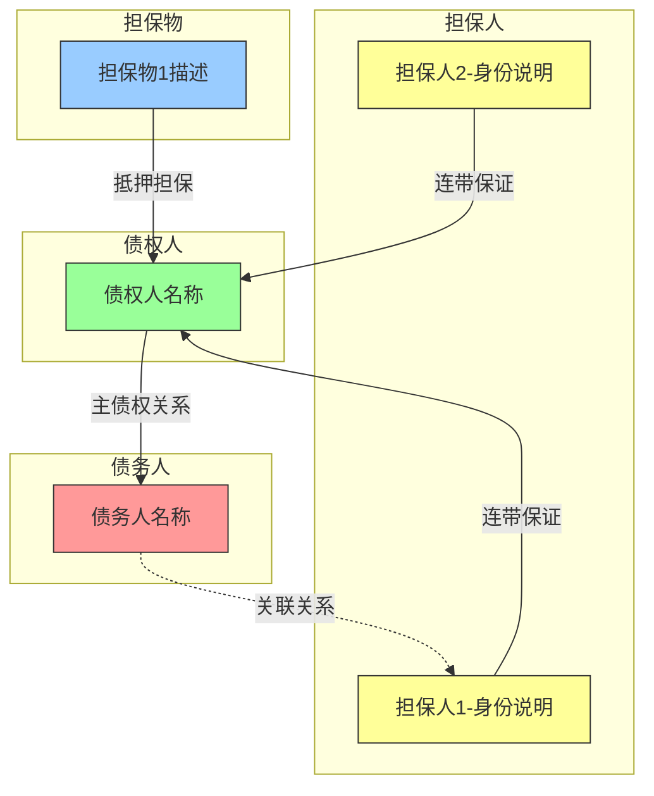
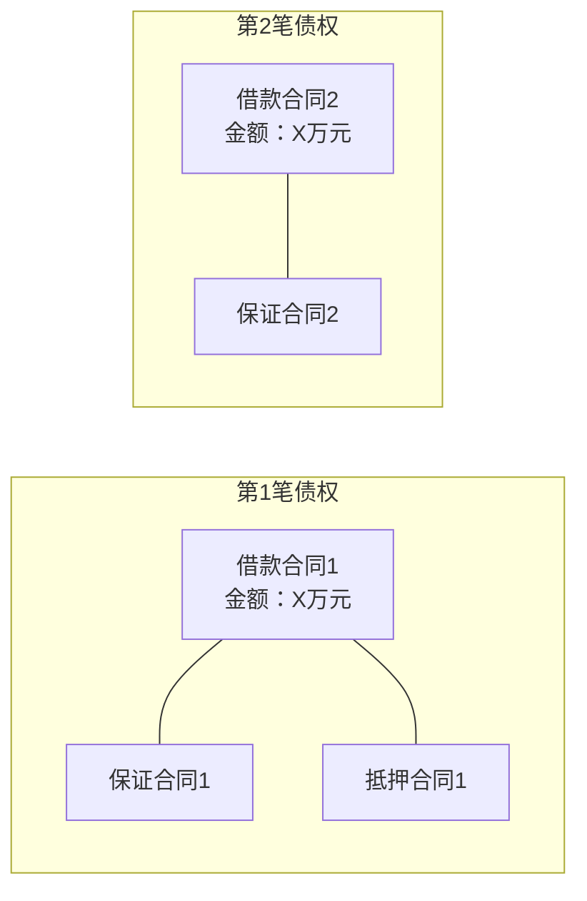
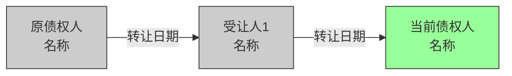

# 法律关系图模板

## 文档说明

本模板定义法律关系图独立文件的标准输出格式。

**生成条件**：
- ≥1个担保人
- ≥1个担保物
- ≥2笔债权
- 存在债权转让

满足任一条件即生成。

**文件命名**：`{债权人名称}_法律关系图.md`

**存放位置**：`工作底稿/`

---

## 标准模板

```markdown
# [债权人名称] 法律关系图

**生成日期**：[YYYY-MM-DD]
**数据来源**：债权结构概览、事实核查报告

---

## 一、主体关系图

本图展示债权人、债务人、担保人之间的法律关系。



---

## 二、合同关系图

本图展示各笔债权与担保合同的对应关系。

[如仅单笔债权，标注：本案为单笔债权，无需合同关系图]



---

## 三、债权转让链图

本图展示债权从原始债权人到当前债权人的转让历程。

[如无债权转让，标注：本案债权人为原始债权人，无债权转让历史]



---

## 四、图例说明

### 颜色含义

| 颜色 | 含义 |
|------|------|
| 绿色 (#9f9) | 债权人（权利方） |
| 红色 (#f99) | 债务人（主债务人） |
| 黄色 (#ff9) | 担保人（保证人） |
| 蓝色 (#9cf) | 担保物（抵押/质押物） |
| 灰色 (#ccc) | 历史主体（已退出关系） |

### 线型含义

| 线型 | 语法 | 含义 |
|------|------|------|
| 实线箭头 | `-->` | 直接法律关系（债权、担保） |
| 实线无箭头 | `---` | 合同从属关系 |
| 虚线箭头 | `-.->` | 关联关系（股权、亲属等） |

---

## 五、关键关系说明

### 5.1 担保覆盖范围

| 担保人/物 | 担保笔数 | 担保范围说明 |
|-----------|----------|--------------|
| [担保人1] | 第1、2笔 | [具体说明] |
| [担保人2] | 第1笔 | [具体说明] |
| [担保物1] | 第1笔 | [具体说明] |

### 5.2 关联关系说明

| 主体A | 主体B | 关联关系 | 依据 |
|-------|-------|----------|------|
| [债务人] | [担保人1] | 股东（持股X%） | 工商登记信息 |
| [担保人1] | [担保人2] | 配偶 | 申报材料记载 |

### 5.3 特殊情况说明

[如有需要特别说明的复杂关系，在此补充文字说明]

---

## 六、核查提示

基于法律关系图分析，后续核查需关注：

1. **担保效力问题**：[如有，说明需要关注的担保效力问题]
2. **担保顺位问题**：[如有，说明担保物权顺位问题]
3. **共同担保问题**：[如有，说明共同担保责任分配问题]
4. **转让效力问题**：[如有，说明债权转让相关问题]
```

---

## 填写规则

### 图表部分

1. **必须修改的内容**：
   - 所有节点名称（债权人、债务人、担保人等）
   - 金额数字
   - 日期
   - 关系类型（连带保证/一般保证等）

2. **可选择的部分**：
   - 不适用的图表类型可删除（但需标注原因）
   - 关联关系（如无法确定可不画）

3. **禁止的操作**：
   - 不得使用占位符作为最终输出
   - 不得省略颜色样式定义

### 表格部分

1. 所有表格必须填写实际内容
2. 无对应信息时使用标准缺失标记
3. 担保覆盖范围必须准确

---

## 质量检查清单

生成法律关系图后，执行以下检查：

- [ ] 所有占位符已替换为实际内容
- [ ] Mermaid代码语法正确（可渲染）
- [ ] 颜色样式已正确应用
- [ ] 所有主体名称与债权结构概览一致
- [ ] 担保关系覆盖范围准确
- [ ] 债权转让链条完整（如适用）
- [ ] 不适用的图表已标注原因
- [ ] 图例说明完整
- [ ] 关键关系说明已填写
